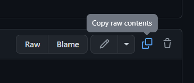

# THE BAT ADVENTURE an applesoft basic project  
## Abstract  
 
I made this fun little project to explore and experiment programming with BASIC and what it was like to work on an extremely limited machine.  
  
In this game you control a little bat that is trying to navigate in a perilous cave filled with stalactite, stalagmite and flying monsters.  

## How to play  
- First open the emulator https://www.calormen.com/jsbasic/  
  
- Then go to [TheBatAdventure](TheBatAdventure) and copy TheBatAdventure.txt file  

- Paste TheBatAdventure.txt file instead of the default "10 PRINT "Hello World"" of the emulator  
  
- Click "Run" and enjoy!  
 

  


## Sources  
Emulator : https://www.calormen.com/jsbasic/  
Video form The Coding Train that inspired this project : https://www.youtube.com/watch?v=7r83N3c2kPw  

```  
print hello
```  
